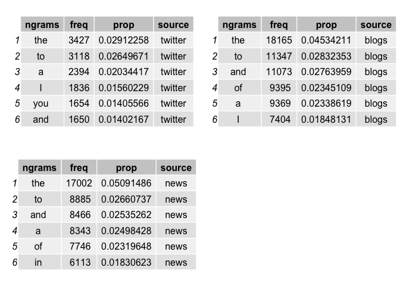
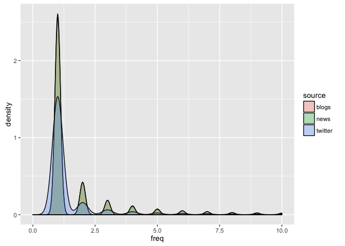
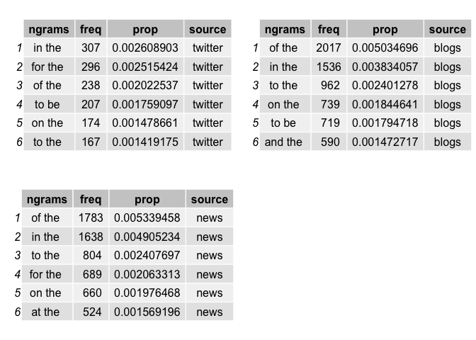
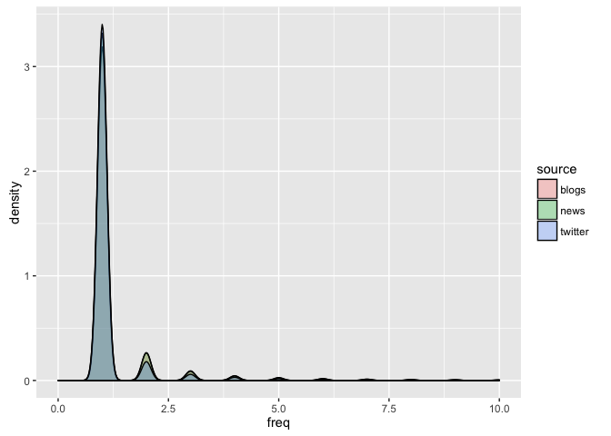
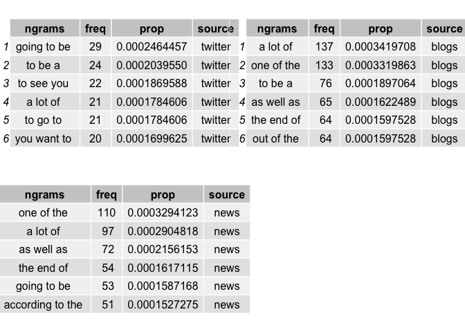
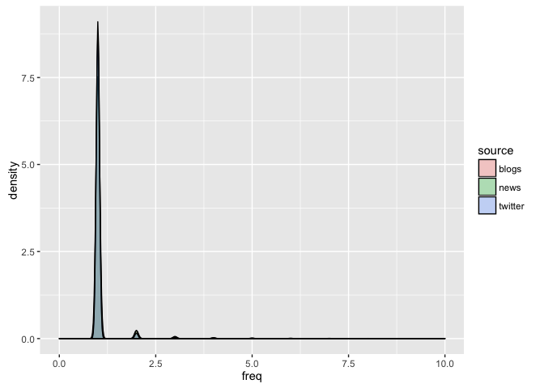

# Preliminary Analysis of N-Grams for the Prediction of Next Text Typed in English Language
J Faleiro  
June 12, 2016  


# Introduction

The goal of this project is to explain major features of the data we have identified and briefly summarize our plans for creating the prediction algorithm for the next English word you will type. 

The motivation of this example is to: 

1. Demonstrate downloading and parsing of the sample dataset.
2. Create a basic report of summary statistics about the data sets.
3. Report any interesting findings.
4. Get feedback on your plans for creating a prediction algorithm. 

This is intended as a short summary. Pre-processing of data and extraction of preliminary features as a preparation of the prediction algorithm to be used.

This report is fully reproducible. Execution on a local environment will cause the installation of required libraries and dependencies.

# Pre-Processing

We start pre-processing by loading the necessary libraries:


```r
pacman::p_load(ngram, ggplot2, gridExtra)
```

We download and unzip the zipped file as needed (checks for existence). We cannot use `knitr` caching due to a crash of an underlying `C` library.


```r
url <- 'https://d396qusza40orc.cloudfront.net/dsscapstone/dataset/Coursera-SwiftKey.zip'
file <- 'training.zip'
```


```r
if (!file.exists(file)) {
    download.file(url, destfile=file, method='curl')
}
```


```r
if (!file.exists('final')) {
    unzip(file)
}
```

We read each of the files individually. Given the nature of this exploration we limit each files to a maximum number of lines.


```r
twitter <- readLines('final/en_US/en_US.twitter.txt', n=10000)
```


```r
blogs <- readLines('final/en_US/en_US.blogs.txt',n=10000)
```


```r
news <- readLines('final/en_US/en_US.news.txt',n=10000)
```

Since each source differ in each line lengths, we should expect different volumes of data per source. At this point it should not be relevant.

For each source - twitter, blogs, and news we extract unigrams, bigrams and trigrams - what is relevant for this analysis.


```r
tw <- paste(twitter, collapse='/n')
tw1 <- ngram(tw, n=1)
tw2 <- ngram(tw, n=2)
tw3 <- ngram(tw, n=3)
```


```r
bl <- paste(blogs, collapse='/n')
bl1 <- ngram(bl, n=1)
bl2 <- ngram(bl, n=2)
bl3 <- ngram(bl, n=3)
```


```r
nw <- paste(news, collapse='/n')
nw1 <- ngram(nw, n=1)
nw2 <- ngram(nw, n=2)
nw3 <- ngram(nw, n=3)
```

We are now ready to start the premilinary analysis.

# Preliminary Analysis

## Word Frequencies

We can peek at a few top samples of each of the sources to get a sense of what type of insights the  data brings:


```r
tw.pt.1 <- get.phrasetable(tw1) 
tw.pt.1$source <- 'twitter'
bl.pt.1 <- get.phrasetable(bl1)
bl.pt.1$source <- 'blogs'
nw.pt.1 <- get.phrasetable(nw1)
nw.pt.1$source <- 'news'
```


```r
grid.arrange(tableGrob(head(tw.pt.1)), 
             tableGrob(head(bl.pt.1)), 
             tableGrob(head(nw.pt.1)),
             ncol=2)
```

<!-- -->
  
* One of the first realizations is that some of the words repeat steadly across sources (_the_, _and_, _to_)
* Source stringly influences patterns and the frequency of words
* The character limitation in twitter brings the frequency and proportion of tokens to lower quantities. A reminder that scaling might be necessary for frequencies, if required.

We can get a comparative sample by extracting densities of frequencies of each words, across each media:


```r
ggplot(data=rbind(tw.pt.1, bl.pt.1, nw.pt.1), aes(x=freq, fill=source)) +
    geom_density(adjust=1.5, alpha=0.3) +
    xlim(0,10)
```

```
## Warning: Removed 7350 rows containing non-finite values (stat_density).
```

<!-- -->

The core conclusion is that one-grams do follow a similar pattern of density attenuation as frequencies increase (as expected).

## Bi-Grams

We can extend the same rationale to bi-grams.


```r
tw.pt.2 <- get.phrasetable(tw2) 
tw.pt.2$source <- 'twitter'
bl.pt.2 <- get.phrasetable(bl2)
bl.pt.2$source <- 'blogs'
nw.pt.2 <- get.phrasetable(nw2)
nw.pt.2$source <- 'news'
```


```r
grid.arrange(tableGrob(head(tw.pt.2)), 
             tableGrob(head(bl.pt.2)), 
             tableGrob(head(nw.pt.2)),
             ncol=2)
```

<!-- -->

On this case we see an even less sparse variation of bigrams. The same exceptions for twitter sentences still apply.

We can get a comparative sample by extracting densities of frequencies of each words, across each source:


```r
ggplot(data=rbind(tw.pt.2, bl.pt.2, nw.pt.2), aes(x=freq, fill=source)) +
    geom_density(adjust=1.5, alpha=0.3) +
    xlim(0,10)
```

```
## Warning: Removed 4975 rows containing non-finite values (stat_density).
```

<!-- -->
  
With less variation we see that an almost complete overlap of densities for each frequency. 

## Tri-Grams

Knowing what we know from the data we should expect the same to happen when we compare the patterns in bi-grams and tri-grams:


```r
tw.pt.3 <- get.phrasetable(tw3) 
tw.pt.3$source <- 'twitter'
bl.pt.3 <- get.phrasetable(bl3)
bl.pt.3$source <- 'blogs'
nw.pt.3 <- get.phrasetable(nw3)
nw.pt.3$source <- 'news'
```


```r
grid.arrange(tableGrob(head(tw.pt.3)), 
             tableGrob(head(bl.pt.3)), 
             tableGrob(head(nw.pt.3)),
             ncol=2)
```

<!-- -->

And... surprise! quite the opposite. The mysteries of data. There is less overalp on tr-grams than on bi-grams.

When we take a snapshot of comparative samples, considering each source:


```r
ggplot(data=rbind(tw.pt.3, bl.pt.3, nw.pt.3), aes(x=freq, fill=source)) +
    geom_density(adjust=1.5, alpha=0.3) +
    xlim(0,10)
```

```
## Warning: Removed 616 rows containing non-finite values (stat_density).
```

<!-- -->
  
The reversal of the pattern is clear, now visually. The peak near zero shows almost unique entries across sources.

# Conclusion

This is just a preliminary analysis, but so far we see that n-grams is a viable approach as long as we adjust for a few exceptions:

* Source of the data matters. Different sources of texts induce different patterns, in other words source must be considered as a feature.

* The position of a word in a sentence also matters, specially for beginning of statements.

* Proportion, more than frequency, should be used as a feature (pending verification of course). A _frequency_ feature scaled and centered is a secondary possibility.

# Reproducibility Notes


```r
sessionInfo()
```

```
## R version 3.2.4 (2016-03-10)
## Platform: x86_64-apple-darwin13.4.0 (64-bit)
## Running under: OS X 10.11.5 (El Capitan)
## 
## locale:
## [1] en_US.UTF-8/en_US.UTF-8/en_US.UTF-8/C/en_US.UTF-8/en_US.UTF-8
## 
## attached base packages:
## [1] stats     graphics  grDevices utils     datasets  methods   base     
## 
## other attached packages:
## [1] gridExtra_2.2.1 ggplot2_2.1.0   ngram_3.0.0     pacman_0.4.1   
## 
## loaded via a namespace (and not attached):
##  [1] Rcpp_0.12.5      codetools_0.2-14 digest_0.6.9     assertthat_0.1  
##  [5] plyr_1.8.4       grid_3.2.4       gtable_0.2.0     formatR_1.4     
##  [9] magrittr_1.5     scales_0.4.0     evaluate_0.9     stringi_1.1.1   
## [13] rmarkdown_0.9.6  labeling_0.3     tools_3.2.4      stringr_1.0.0   
## [17] munsell_0.4.3    yaml_2.1.13      colorspace_1.2-6 htmltools_0.3.5 
## [21] knitr_1.13
```


